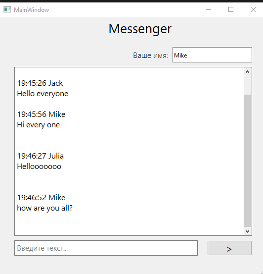
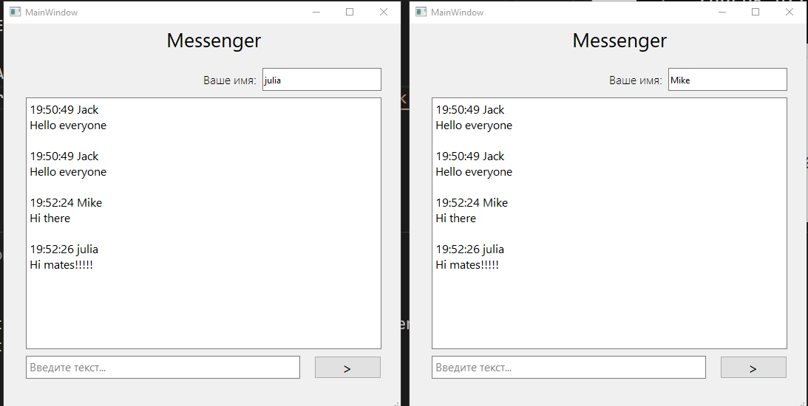
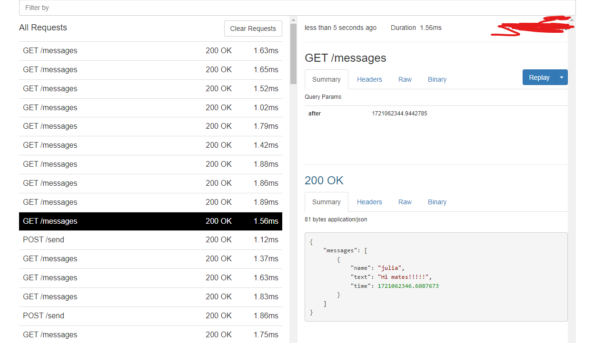

## Experienced Python Developer with PyQt6 and Networking Expertise

As an experienced Python developer, I specialize in creating robust and efficient desktop applications using PyQt6. Recently, I developed a versatile messenger application that leverages the power of PyQt6 for the user interface and utilizes ngrok to enable seamless communication across different devices and networks.

### Key Features of My Messenger Application:

- **Intuitive User Interface:** Designed with PyQt6, offering a sleek and user-friendly experience.
- **Cross-Device Communication:** Integrated ngrok to facilitate secure and reliable communication across various devices, ensuring your messages are always within reach.
- **Real-time Messaging:** Implemented real-time messaging capabilities, providing instant and efficient communication.
- **Secure Connection:** Ensured data privacy and security through encrypted connections and robust security protocols.

### Technical Skills:

- **Python Development:** Proficient in Python, with extensive experience in developing desktop applications.
- **PyQt6:** Expert in PyQt6 for creating intuitive and responsive graphical user interfaces.
- **Networking:** Skilled in using ngrok to establish secure tunnels and enable cross-device communication.
- **Real-time Communication:** Knowledgeable in implementing real-time messaging and data transfer protocols.
- **Problem Solving:** Strong analytical and problem-solving skills, ensuring high-quality and reliable software solutions.

With a proven track record of developing high-quality applications, I am ready to bring my expertise to your project. Let's collaborate to create exceptional software solutions that meet your needs.
